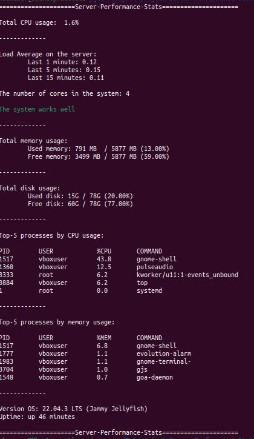

# Server Performance Stats

___

A bash script to analyse basic server performance stats. The idea for the project wat taken from the website: [https://roadmap.sh/projects/server-stats](https://roadmap.sh/projects/server-stats)

## Getting Started

___

1. **Clone the repository**
    
    ```
    git clone https://github.com/alexdrsev/Pet-project-Server-Performance-Stats.git
    cd pet_project_server-stats
    ```
    
2. **Make the script executable**
    
    ```
    chmod +x server-stats.sh
    ```
    
3. **Execute the script**
    
    ```
    ./server-stats.sh
	```


Expected conclusion:




